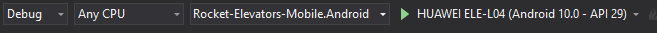
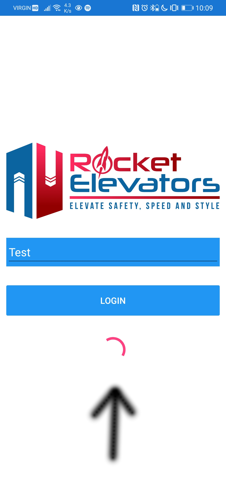
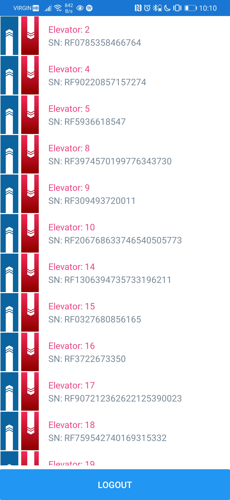
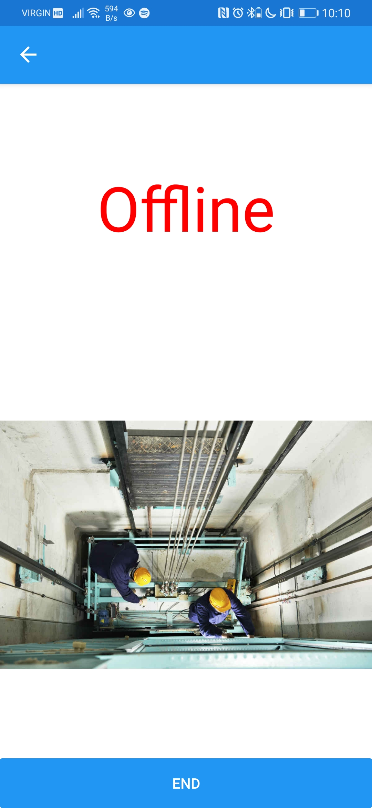
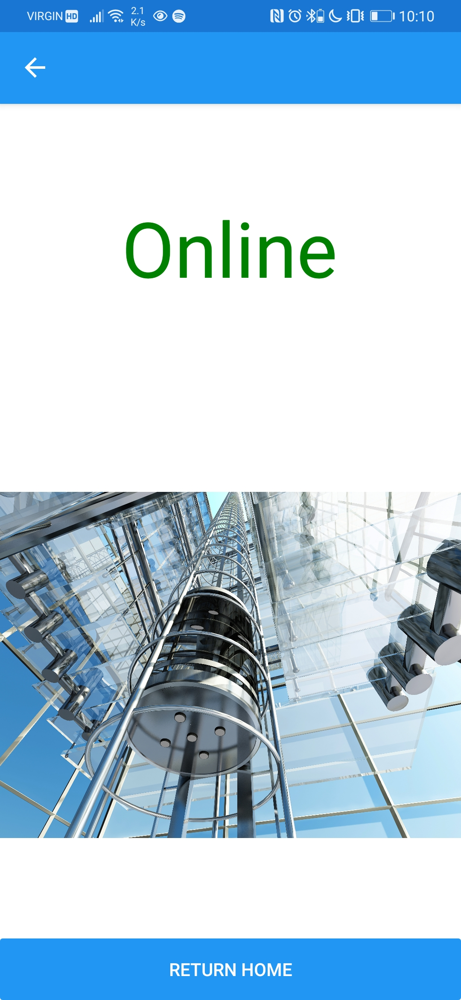
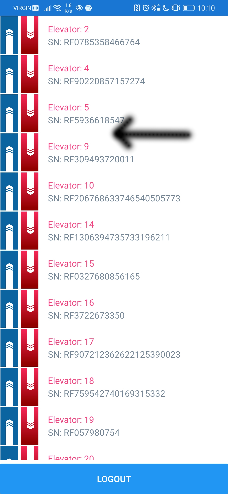
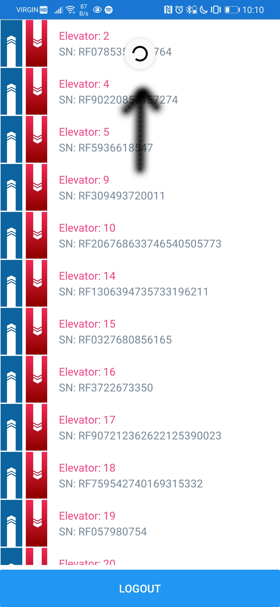

<br/>
<p align="center">
  <a href="https://github.com/YenXm/Rocket-Elevators-Mobile">
    
  </a>

  <h3 align="center">Rocket Elevators Mobile Application</h3>

  <p align="center">
    A mobile application for Rocket Elevator workers to interface with the information system
    <br/>
    <br/>
    <a href="https://github.com/YenXm/Rocket-Elevators-Mobile">View Demo</a>
    .
    <a href="https://github.com/YenXm/Rocket-Elevators-Mobile/issues">Report Bug</a>
    .
    <a href="https://github.com/YenXm/Rocket-Elevators-Mobile/issues">Request Feature</a>
  </p>
</p>

   

## Table Of Contents

- [Table Of Contents](#table-of-contents)
- [About The Project](#about-the-project)
- [Built With](#built-with)
- [Getting Started](#getting-started)
  - [Prerequisites](#prerequisites)
  - [Installation](#installation)
- [Usage](#usage)
- [Authors](#authors)

## About The Project
TODO


## Built With

Xamarin form 5.0.0.2012

Xamarin essentials 1.6.1

## Getting Started
### Prerequisites

1. Visual Studio

2. Android/IOS emulator or phone

3. IOS developer account (only for IOS)

### Installation

1. Clone the repo and open the solution in Visual Studio

    ```sh
    git clone https://github.com/YenXm/Rocket-Elevators-Mobile.git
    ```

    Alternative: Use the clone repo option when creating a new project using Visual Studios


2. Install NuGet packages

    If they do not come installed in your cloned solution, then install these nuget by going into your NuGet manager in VS :

    - Microsoft.Extensions.Http 6.0.0
    - Microsoft.Net.Http.Headers 2.2.8
    - Refractored.MvvmHelpers 1.6.2
    - System.ComponentModel.Annotations 5.0.0
    - System.Net.Http 4.3.4
    - System.Net.Http.Json 5.0.0
    - System.Runtime.Serialization.Json 4.3.0
    - System.Text.Json 5.0.2
    - Xamarin.Essentials 1.6.1
    - Xamarin.Forms 5.0.0.2012

3. Set Up your phone or emulator

    It is necessary to configure your phone to the developer mode.

    - Android :

        https://tweaklibrary.com/how-to-enable-developer-mode-on-android/
    
    - IOS :

        __Please not that a apple id developer account is required__

        There are multiple different way of enabling it:

        https://docs.microsoft.com/en-ca/xamarin/ios/get-started/installation/windows/?pivots=windows
        
        https://docs.microsoft.com/en-us/xamarin/tools/ios-simulator/

        https://www.wikihow.com/Enable-Developer-Mode-on-an-iPhone


## Usage

1. Plug your phone into your computer.

2. In Visual Studio
   
    Select the proper startup project corespondig to your phone type and click play

    

    **Note that while connected on the debugger, the app will be slower, it is better to closed the debugger session and restart the app manually on your phone afterward.**

3. To login to the app you must enter a valid employee email address.

    For debugging the "test" email is available but for the complete list of available email addresses please refer to this [document](employees_email.txt)

    If no one has used the app in a while, it may take a while for the app to process the request (this is cause by the api leaving sleep mode). You can see that it is loading by this indicator

    

4. Home screen
   
    The list here represent all the elevator with status that is not "Online".

    The 2 text field represent the elevator id (in the information system) and its serial number.

    

    You can either click on one of the elevator to proceed to the next page or click logout at the bottom to go back to the login page.

5. Elevator Status Screen

    Pretty simple screen, it show you the status of the elevator and allow you to end the interruption and then go back to the home screen.

    We clicked on elevator 8.

      
      

6. Lastly, Home screen refresh

    Everytime you got back to the home screen it will refresh itself but, you can manually refresh it by pulling the top of the screen.

    You can see that the elevator 8 is not present anymore.

      
      


## Authors

* **YenXm (Levy)** - *CodeBoxx Student* - [YenXm](https://github.com/YenXm/) - 